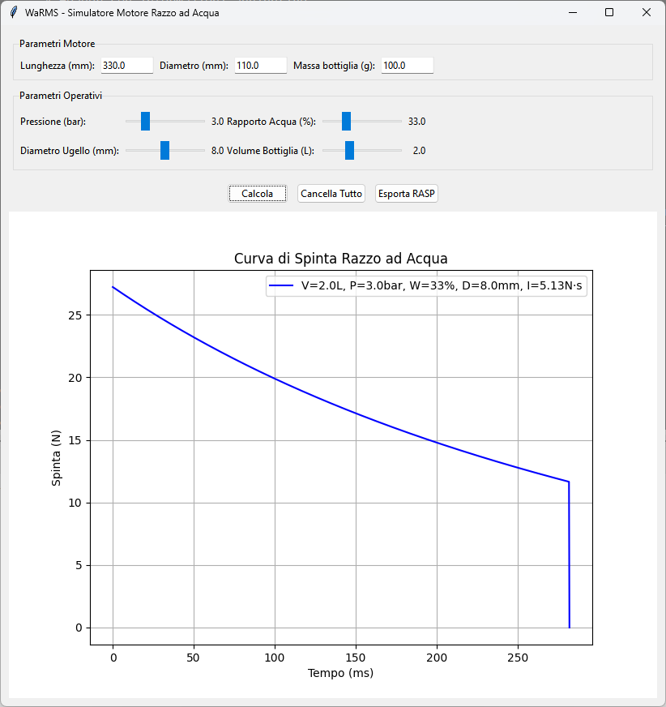

# WaRMS
Water Rocket Motor Simulator

Un semplice calcolatore per "motori razzo" ad acqua;
calcola il grafico della spinta nel tempo, tenendo conto di
* Pressione iniziale
* Rapporto aria/acqua
* Diametro ugello
* Volume totale

La legenda del grafico indica questi valori: V=Volume, P=Pressione, W=Rapporto, D=Diametro, I=Impulso totale
Ogni volta che si preme [Calcola] viene aggiunto un nuovo grafico, [Cancella tutto] ovviamente cancella tutto,
e [Esporta RASP] permette di esportare i dati del motore in formato [RASP](https://www.thrustcurve.org/info/raspformat.html)
compatibili con software di simulazione razzi quali [OpenRocket](https://openrocket.info/)

Il software è scritto in Python e utilizza
* [tkinter](https://docs.python.org/3/library/tkinter.html) per la GUI
* [numpy](https://numpy.org/) per i calcoli
* [matplotlib](https://matplotlib.org/) per i grafici

Questo software è libero, ed è sviluppato da [Italian Rocketry Society](https://www.rocketry.it) una associazione italiana di missilistica amatoriale

