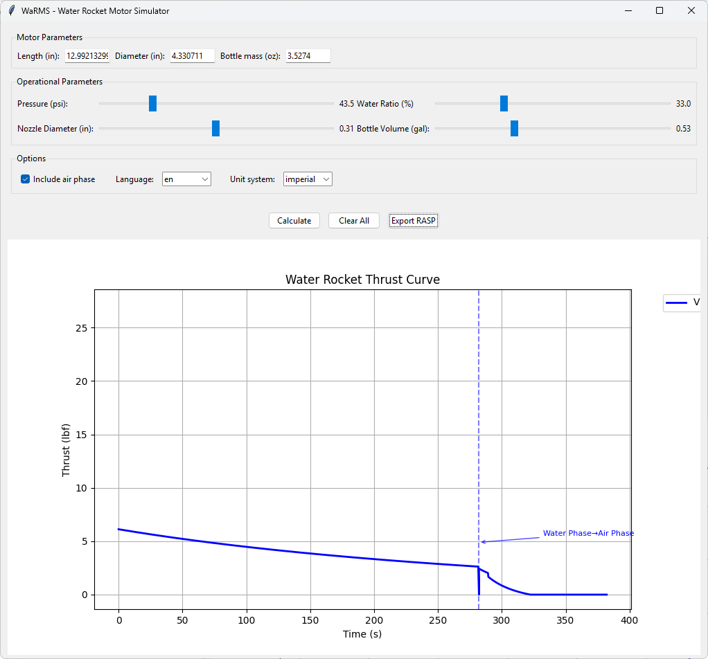

# WaRMS
Water Rocket Motor Simulator



An advanced simulator for water rocket "motors" with multilingual interface;
calculates thrust-time graphs, taking into account:

## 🚀 Physical Parameters
* **Initial pressure** - slider control (1-10 bar)
* **Air/water ratio** - fill percentage (10-90%)
* **Nozzle diameter** - exhaust opening size (4-12 mm)
* **Total volume** - bottle capacity (0.5-5 L)
* **Bottle dimensions** - length and diameter for accurate calculations
* **Bottle mass** - empty weight for specific impulse calculation

## ✨ Advanced Features

### 🌍 **Multilingual Interface**
- **Italian** and **English** fully supported
- Instant language switching via dropdown
- All labels, charts, and messages translated

### 🌪️ **Two-Phase Simulation**
- **Water Phase**: Main thrust during liquid propellant expulsion
- **Air Phase**: Residual thrust from compressed air expansion (optional)
- Graphically visualized transition with annotations
- Separate impulse calculation for each phase

### 📏 **Flexible Unit System**
- **Metric**: mm, bar, L, g, N
- **Imperial**: inch, psi, gallons, ounces, lbf
- Automatic conversion of all parameters
- Internally consistent calculations

### 📊 **Performance Analysis**
- **Total impulse** calculated for NAR classification
- **Burn time** and average thrust
- **High-resolution thrust curve** (1000+ points)
- **Detailed legend** with all significant parameters

## 🎮 Interface Controls

The **graph legend** shows these values in compact format:
- **V** = Bottle volume
- **P** = Initial pressure  
- **W** = Water ratio (%)
- **D** = Nozzle diameter
- **I** = Total impulse
- **W:X+A:Y** = Separate water+air impulses (if air phase active)

### Main Buttons
- **[Calculate]** → Generate new curve and add to graph
- **[Clear All]** → Remove all curves and reset graph  
- **[Export RASP]** → Save last curve in standard format for simulators

## 🔧 Software Compatibility

The **RASP export** generates `.eng` files compatible with:
- **[OpenRocket](https://openrocket.info/)** - Open source rocket simulator
- **RockSim** - Commercial software by Apogee Components
- **Other simulators** supporting standard RASP format

Files include:
- Header with complete motor configuration
- Generation metadata and parameters used
- Time-stamped thrust curve in standard format
- Automatic NAR classification (A, B, C, D, E...)

## 🛠️ Technical Requirements

The software is developed in **Python 3.7+** and uses:

* **[tkinter](https://docs.python.org/3/library/tkinter.html)** - Native GUI interface
* **[numpy](https://numpy.org/)** - Numerical calculations and integration
* **[matplotlib](https://matplotlib.org/)** - Plotting and visualization

### Installing Dependencies
```bash
pip install numpy matplotlib
# tkinter is included in most Python distributions
```

## 🔬 Implemented Physics

### Mathematical Model
- **Adiabatic expansion** of compressed air (γ = 1.4)
- **Bernoulli's equation** for exhaust velocity
- **Mass conservation** for flow rate
- **Compressible fluid dynamics** for air phase

### Approximations
- Discharge coefficient Cd = 0.95
- Constant water density (1000 kg/m³)
- Constant ambient air temperature
- Negligible pressure losses

## 🏆 Credits

This software is **open source** (CC0 license) and is developed by **[Italian Rocketry Society](https://www.rocketry.it)**, 
an Italian amateur rocketry association.

### Contributions
- Original design and physics implementation
- Multilingual system and unit conversions
- Two-phase water/air algorithm
- Extended RASP compatibility

---

*For bug reports, suggestions, or contributions, contact Italian Rocketry Society or open an issue in the repository.*
